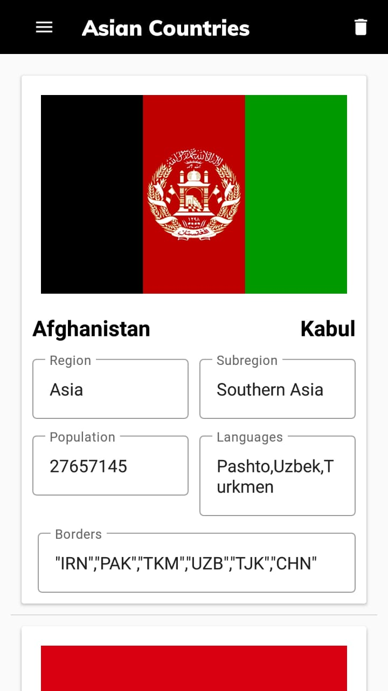

# CountriesInfo
This is basic Rest Api application which contains information about countries. I used Volley library with nested json parsing. Also I used Room Persistence Library for geting data when offline. 
<b>Screnshot</b> 

